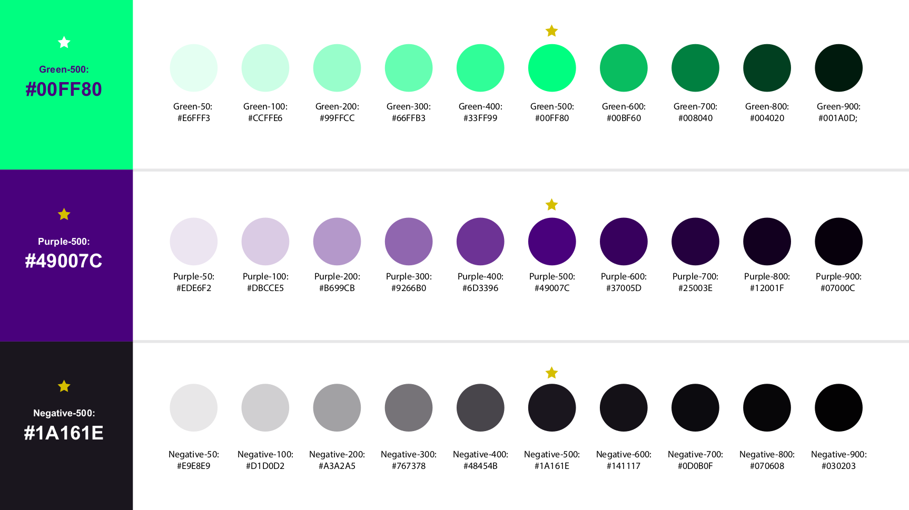

# Requisitos da Ideia

Neste momento os requisitos estão sendo criados pensando em um **MVP**.   

Para não não perder o foco no **MVP** pensando em muitas coisas, vamos seguir o conceito de Design [Kiss - Keep It Simple, Stupid](https://uxdesign.blog.br/a-origem-do-keep-it-simple-stupid-kiss-b24085dc1327)

## Requisitos funcionais
--------------------------

- [ ] O usuário deve se autenticar usando email e senha.
- [ ] Após o login o usuário deve ser redirecionado para um **Dash** onde será exibido os Cursos que este usuário está inscrito, a exibição deve ser em formato de **Cards**.
- [ ] Quando o usuário clicar em um Card de Curso ele deve ser direcionado para a pagina de **Sala de Aula**.

## Requisitos não funcionais
-----------------------------

- [ ] Durante o desenvolvimento devemo **sempre** seguir o conceito **Kiss**
- [ ] Usar Rect Navigation para nossas rotas
- [ ] Usar [reactstrap](https://github.com/reactstrap/reactstrap) como abastração do Bootstrap 4
- [ ] Usar a paleta de cores e-Programar
- [ ] Deve ser possivel escrever um conteudo teórico em **Markdown** para ser exibido tipo Github na tela de **Sala de aula**

## Regras de negócio
---------------------

- [ ] **Login estático:** WIP
- [ ] **Dash de Cursos:** WIP
- [ ] **Sala de Aula:** WIP

## Tomada de decisões
---------------------

- O objetivo do **MVP** é uma plataforma onde seja possivel através de um usuário, carregar a lista de Cursos que ele está inscrito e ao clicar em um Curso carregar os Módulos e Conteúdo de cada Aula, com o foco totalmente no Front-end. Então, não queremos nos preocupar neste momento com um Back-end, para isso devemos seguir o desenvolvimento com uma estrutura de dados estática no front e depois mover para uma base de dados tipo Firebase ou Mongo Atlas usando talves um Lambda para expor um endpoint de leitura dessa base. Tudo para não depender de Infra, deploy, CI/CD de Back-end neste momento.

## [Paleta de Cores](./images/colors-pallete.png)
--------------------

- Roxo #49007C
- Verde #00FF80
- Preto #1A161E

